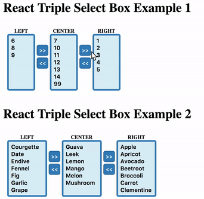

# react-triple-select-box
A simple, dependencies-free and dumb react component to render triple select boxes.

## How To use

### Import

#### CommonJS
	var Alert = require('react-triple-select-box/lib/TripleSelectBox');
	// or
	var Alert = require('react-triple-select-box').TripleSelectBox;
#### ES6
Es6 modules aren't supported natively yet, but you can use the syntax now with the help of a transpiler
like Babel.

	import TripleSelectBox from 'react-triple-select-box/lib/TripleSelectBox';
	// or
	import { TripleSelectBox } from 'react-triple-select-box';
	
###See the [Examples](docs/examples.md) and the list of [Props](docs/props.md) for more details.
