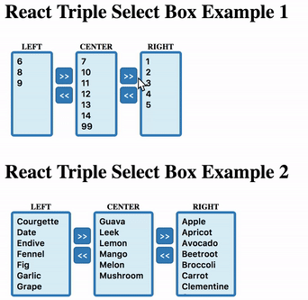

# react-triple-select-box
A simple, dependencies-free and dumb react component to render triple select boxes. Since version 2.0.0 requires React v16.8 or greater.



## How To use

#### CommonJS Import
	const TripleSelectBox = require('react-triple-select-box')
#### ES6 Import
	import TripleSelectBox from 'react-triple-select-box'
#### Props

##### Valid option formats

- ##### Object:
```js
    {
        /* MANDATORY */
        value, // oneOfType: [ number, string ]
        /* OPTIONAL */
        label, // string
        /* OPTIONAL */
        selected, // boolean
    }
```

- ##### String or Number: 
```js
    'A valid option'
    12
```

##### All props
```js
    {
        /* MANDATORY */
        options: {
            left, // Array of options to be rendered on left select box
            center, // Array of options to be rendered on center select box
            right // Array of options to be rendered on right select box
        },
        /* OPTIONAL */
        titles: {
            left, //  Left Select Box Tile (string)
            center, // Center Select Box Tile (string)
            right // Right Select Box Tile (string)
        },
        /* OPTIONAL */
        numberOfLines: {
            left, //  Left Select Box size (number)
            center, // Center Select Box size (number)
            right // Right Select Box size (number)
        },
        /* OPTIONAL */
        styles: {
            container, // Root container style (Object)
            box: {
                label, // Select box labels style, (Object)
                container, // Select box containers style (Object)
                select, // Select Boxes styles (Object)
                selectOption // Select Options style (Object)
            },
            boxController: {
                container, // Select box controller container style (Object)
                button // Button controller style (Object)
            }
        },
        /* MANDATORY */
        onChange: ({ left, center, right }) => {} // Callback invoked on values changes
    }
```
#### Examples
```js
<TripleSelectBox
    	options={{
            left: [
                'Courgette',
                'Date',
                'Grape'
            ],
            center: [
                'Mango',
                'Lemon',
                'Leek'
            ] ,
            right: [
                'Apple',
                'Orange'
            ]
        }}
        onChange={({ left, center, right }) => {
        	console.log({ left, center, right })
        }}
/>
```

```js
<TripleSelectBox
    	options={{
            left: [
                { value: 'Courgette', selected: true, label: 'cgt' },
                { value: 'Date' }
            ],
            center: [
                { value: 'Mango' }
            ],
            right: [
                { value: 'Apple' },
                { value: 'Orange' }
            ]
        }}
        onChange={values => {
        	console.log({ values })
        }}
/>
```

#### Contributions
Contributions are welcome, just open a PR and contact me :-).

